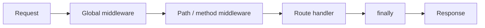

Execution stacks determine the order in which middleware and your route handler run for each incoming request. A stack is assembled per-route from all middleware that matches the request's path and method, building a final chain that is unique to each route.

Lambda API v0.10 introduced execution stacks as a way to more efficiently process middleware. Execution stacks are automatically created for you when adding routes and middleware using the standard route convenience methods, as well as `METHOD()` and `use()`. This is a technical implementation that has made [method-based middleware](/docs/middleware-errors/middleware) and additional wildcard functionality possible.

Execution stacks are backwards compatible, so no code changes need to be made when upgrading from a lower version. The only caveat is with matching middleware to specific parameterized paths. Path-based middleware creates mount points that require methods to execute. This means that a `/users/:userId` middleware path would not execute if you defined a `/users/test` path.

Execution stacks allow you to execute multiple middlewares based on a number of factors including path and method. For example, you can specify a global middleware to run on every `/user/*` route, with additional middleware running on just `/user/settings/*` routes, with more middleware running on just `GET` requests to `/users/settings/name`. Execution stacks inherit middleware from matching routes and methods higher up the stack, building a final stack that is unique to each route. Definition order also matters, meaning that routes defined _before_ global middleware **will not** have it as part of its execution stack. The same is true of any wildcard-based route, giving you flexibility and control over when middleware is applied.

For debugging purposes, a `REQUEST` property called [`stack`](/docs/request-response/request-object) has been added. If you name your middleware functions (either by assigning them to variables or using standard named functions), the `stack` property will return an array that lists the function names of the execution stack in processing order.
